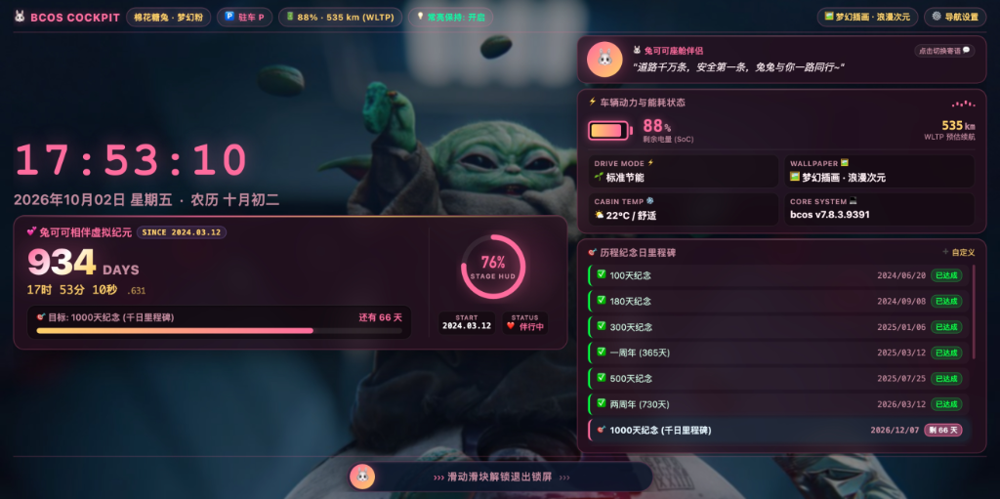
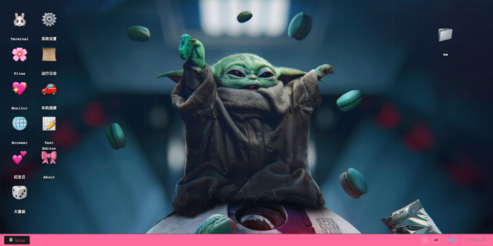

# 🐰 兔可可王国 · bcos 虚拟系统 & 智能座舱车机锁屏

> **Bunny Cockpit OS (bcos)** · 专为智能新能源车机中控大屏、桌面及移动端精心打造的沉浸式虚拟操作系统与纪念日流转空间。

---

## 🌟 项目简介

**bcos (Bunny Cockpit OS)** 是一套融合了**极客智能座舱中控锁屏**、**bcos 虚拟桌面与终端系统**、**大富翁商业模拟沙盒**以及**毫秒级纪念日流转体系**的现代化 Web / PWA 应用。

针对智能电动汽车（如蔚来 NIO、小鹏、理想、特斯拉等）车机大屏的比例、触控交互与暗光座舱环境做了深度优化，不仅支持全屏沉浸运行与屏幕常亮保持（Screen WakeLock），更针对车机 OLED 中控屏搭载了**离散防烧屏（Pixel Shift）**与智能微暗保护技术。

---

## 📸 界面预览 (Screenshots)

### 🚗 智能座舱中控车机锁屏 (Cockpit Screen)
> 统一 28px 对称药丸胶囊状态栏 · 阶段达成率 HUD 环形仪表 · 车辆动力与 WLTP/实估双标准续航遥测 · 底部防误触滑动解锁

### 🖥️ bcos 虚拟系统桌面 (Cockpit Desktop)
> 沉浸式宽屏中控桌面 · 窗口化多任务与车机快捷应用 · 专属座舱壁纸与实时状态监控栏

### ⚙️ bcos 快捷控制中心与上下文菜单 (Context Menu & Start Menu)
> 一键直达终端、文件创作、车机锁屏 HUD、多主题切换与个性化外观

---

## 🚗 核心系统模块

### 1. 智能座舱车机锁屏 (Cockpit Screen)
- **极客 HUD 仪表盘**：集成数字车机大时钟、公历/农历联动、阶段达成率 HUD 环形仪表盘及毫秒级伴行倒计时。
- **统一胶囊状态微组件**：顶部状态栏全要素标准化为 28px 药丸胶囊徽章（网络/档位/动力遥测/常亮保持/壁纸/导航中心），高低对齐、圆角统一，支持微发光悬浮动效与轻量 Cyber 气泡提示。
- **动力与续航遥测系统**：支持精准输入与滑块调节电量 SoC（0%~100%），支持 **WLTP 国家标准工况** 与 **动态实估工况** 双标准自由切换与快捷步进调校。
- **现代化座舱壁纸引擎**：
  - **多维比例自适应 (macOS 原生级 Popover)**：支持 5 种专业自适应缩放模式（Fill Screen 充满屏幕、Fit to Screen 适应屏幕等比完整、Stretch to Fill Screen 强制拉伸填满、Center 居中原始1:1像素、Tile 平铺阵列网格），适配任何比例的车载中控大屏、竖屏、异形屏与自定义上传图片。
  - **自动轮播**：自动检测壁纸库图片并按设定时长（1~30分钟）平滑循环换幕。
  - **固定壁纸**：支持自主上传本地图片或填入在线外链，固定精美座舱背景。
  - **纯净色彩**：一键去除壁纸，呈现极简科技感座舱氛围底色。
  - **暗化与虚化**：配备实时遮罩浓度（0%~85%）与轻微高斯虚化调节，确保时间与文字清晰锐利。
- **OLED 智能防烧屏保护 (Pixel Shift)**：
  - 采用分钟级 8 点离散微位移机制，彻底消除车机中控长时间驻留导致的烧屏风险。
  - 静置 6 秒后自动进入柔和微暗保护状态，触碰屏幕或滑动即刻瞬时唤醒归零，零卡顿零重绘闪烁。
- **原生系统字体自适应回退**：
  - 针对国内网络及无 Google Fonts 的车机离线环境，无缝回退至系统高阶默认字库（Apple SF Pro / PingFang SC / Windows Segoe UI / HarmonyOS Sans / 微软雅黑等），杜绝字体发虚或加载白屏。
- **趣味陪伴互动**：集成兔可可座舱寄语卡片，轻点即可循环切换暖心寄语；搭载座舱音乐律动柱状图。
- **防误触滑动解锁**：底部拟物交互滑轨，支持手势拖拽、触控滑动及点击快速解锁。

### 2. bcos 虚拟桌面与终端 (Cockpit Desktop & Shell)
- **窗口化多任务操作**：支持窗口拖拽、最小化、全屏、多任务层叠切换。
- **bcos CLI 终端**：提供极客风格的命令行环境，支持系统指令、车况诊断、应用启动与状态查询。
- **座舱氛围主题**：棉花糖粉、深邃星空、森林旷野、深海蓝调等多套车机座舱专属色彩。

### 3. 大富翁王国沙盒 (Monopoly World)
- 环形岛屿多区域大地图与地产交易沙盒。
- 智能 AI 对弈引擎、随机机遇命运事件、破产清算救济与上帝模式。

### 4. PWA 渐进式离线支持
- 采用优化版 Service Worker 缓存架构，支持断网秒级启动。
- 可通过浏览器「添加到主屏幕」作为独立原生 App 运行，隐藏地址栏与导航条，实现全屏真车机沉浸体验。

---

## 📋 版本更新日志

### **v7.8.6.9470** *(当前版本)*

#### 【车辆品牌自定义与桌面图标排版优化】
1. **车辆品牌 / 车型 / 版本 / VIN 可选可自定义** `[适用于 index.html]`：系统设置「车辆与能耗」新增车辆档案卡片，内置蔚来、乐道、小鹏、理想、特斯拉、比亚迪、极氪、小米、问界、阿维塔、smart、MINI 等品牌及常见车型联动选择，亦可选择「自定义品牌 / 自定义车型」手动输入，并可自定义版本名称与 VIN（留空自动生成）；「关于本系统」中的车辆识别与能耗页副标题随之实时同步，设置持久化保存，并支持一键恢复默认 NIO ET7。
2. **桌面图标名称显示优化** `[适用于 index.html]`：图标名称改用无衬线字体并取消按字符强制断行，修复 `Code Studio`、`Sand Studio Pro` 等英文名称被拆成 `Stud io` 的问题。
3. 版本号、PWA 缓存与文档同步升级至 **v7.8.6.9470**。

---

### **v7.8.6.9460**

#### 【桌面图标与壁纸库显示修复】
1. **桌面图标标签被压扁/截断/缺失修复** `[适用于 index.html]`：修复图标列过长时 Flex 布局压缩图标高度，导致图标名称只剩一线、完全消失或上下图标相互重叠的问题；图标与标签改为不可压缩，手机竖屏下重新适配图标尺寸并保证 Dock 栏始终在底部可见。
2. **图标坐标自动纠偏**：升级桌面图标状态存储，清除旧版本在压缩状态下保存的错误坐标，并对同列图标强制最小垂直间距，杜绝重叠。
3. **锁屏壁纸选择框显示不全修复** `[适用于 index.html / car.html]`：壁纸缩略图不再被裁切（完整显示任意比例壁纸），取消壁纸列表的嵌套滚动、由弹窗整体滚动，缩放模式下拉菜单改为内嵌展开，不再被弹窗边缘遮挡。
4. **控制台报错修复** `[适用于 index.html]`：修复窗口缩放时 `getWallpaperFit is not defined` 的作用域错误；大富翁存档地图变更后重建的棋盘立即写回存档，避免每次启动重复告警。
5. 版本号、PWA 缓存与文档同步升级至 **v7.8.6.9460**。

---

### **v7.8.6.9450**

#### 【BCOS 操作系统全场景深度重构与生态升级】
1. **BCOS 访达 (Finder) 深度重构** `[适用于 index.html]`：
   - **macOS 双栏文件管理器**：彻底告别单一代码列表，全面升级为现代化双栏 Finder 访达文件管理器（左侧个人收藏/主目录/文稿/桌面/代码仓/系统卷），支持深层目录树级导航与返回上一级。
   - **文件新建与本地文件拖拽导入**：支持在当前目录下快速新建文本文档、新建文件夹；支持通过文件选择器或直接拖拽本地多文件到访达窗口即刻自动写入 BCOS VFS 虚拟文件系统。
   - **原生文件关联双向互通**：双击 Markdown / 文本 / JS / HTML 代码文件自动调用并唤起 Code Studio 打开编辑；在 Code Studio 中保存文件实时同步刷新访达，桌面与应用协同更加紧密。
   - **代码仓完整保留**：无缝内嵌 GitHub 代码仓浏览与星标/语言统计，支持打开详情卡片与浏览器直达。

2. **Code Studio (代码编辑器) 文件交互全修复** `[适用于 index.html]`：
   - **打开文件对话框补全**：修复此前工具栏「📂 打开」无响应的缺陷，补全应用内 VFS 目录树选择器与本地电脑文件上传入口。
   - **本地代码文件拖拽直开**：支持将本机的 `.html` / `.js` / `.css` / `.json` / `.md` 等文件直接拖拽至编辑器画布，秒级解析并创建对应标签页。
   - **保存路径修正与标签页复用**：修复保存操作在多级子目录下的定位写入，打开同名/同路径文件自动对齐并复用活动标签页，状态栏实时更新高亮与字节计数。

3. **桌面图标自由移动、重命名与删除管理** `[适用于 index.html]`：
   - **自由拖拽排布与轻量吸附**：桌面图标支持鼠标与触控手势自由拖拽，自动脱离流式布局并在释放时按 10px 细微网格微吸附排布，位置坐标经由 `localStorage` 持久化记忆。
   - **右键/长按全功能管理菜单**：右击或长按桌面图标弹出专属快捷操作菜单，支持打开应用、自定义重命名、删除自定义应用、卸载应用商店程序或移除系统快捷方式，并提供「恢复默认桌面图标」一键重置功能。
   - **全场景防退出全屏模态弹窗**：重命名与删除确认采用应用内深度定制的雾面毛玻璃亚克力对话框，彻底杜绝调用原生 `window.prompt` / `confirm` 导致车机浏览器强退全屏的恶性体验。

4. **应用商店 (App Store) 与应用工坊自上传优化** `[适用于 index.html]`：
   - **缓存状态重置**：修复已上传上一个应用后再上传新应用时，名称和图标仍残留上一个应用信息的 bug；重新选文件或保存后自动清空工作台表单。
   - **智能短应用名截取**：新增 `✂️ 短名` 按钮与自动名称清洗算法，智能剔除网站标题后缀（如 `- 在线工具`、`| 官网` 等）并将过长字符紧凑截取，完美契合桌面与 Dock 栏图标美学排版。
   - **预设 Emoji 图标选择器**：在应用工坊新增 30+ 常见分类高频 Emoji 图标点选器，免除手动输入 Emoji 的烦琐操作，一键点选即刻生效。
   - **菜单栏自上传应用名映射**：修复激活自定义应用窗口时，macOS 顶栏左侧应用名称显示为 `custom_app_1791...` 原始内部 ID 的严重缺陷，自动映射为自定义应用的实际短名称。
   - **自定义应用最大化避让修复**：修复自上传应用在双击标题栏最大化时覆盖顶栏与底栏的计算误差，高度自适应限制为 `calc(100% - 30px - 74px)`，并在窗口拖拽与缩放时自动冻结内部 iframe 鼠标穿透，杜绝指针事件被吞没或标题栏失灵。

5. **系统设置全面重构为 macOS Ventura/Sonoma 经典布局** `[适用于 index.html]`：
   - **左侧导航分类与账户徽章**：参考现代 macOS 系统设置架构，左侧集成全局搜索框、兔可可 Cockpit 账户信息卡片，以及 Wi-Fi、车辆与能耗、通用、外观与主题、桌面与程序坞、显示器、关于本系统等经典微拟物彩标列表。
   - **右侧分组卡片深度联动**：右侧采用半透明磨砂分组卡片式设计，全面集成桌面氛围主题点选、侧边栏头像切换、像素字体开关、鼠标发光轨迹、壁纸图库轮播、字体缩放滑动条、车机电量 SOC 模拟控制与硬件参数概览，交互流畅直观。

6. **Dock 栏实时日历与时钟组件** `[适用于 index.html]`：
   - **动态日历图标**：Dock 栏右侧新增具有 macOS 视觉基因的实时动态日历图标（红色月份标头与大字日期），随系统时间动态更新。
   - **秒级实时时间与星期走字**：日历旁侧紧跟实时数字时钟（时:分:秒）与星期，hover 悬浮呈现微拟物时间戳气泡，顶栏与 Dock 栏时钟全秒级同步精准刷新。

7. **座舱天气看板接入 Open-Meteo 国际免费天气 API** `[适用于 index.html]`：
   - **纯净无 Key 气象数据接口**：告别写死静态展示，全面接入免费开源、支持 HTTPS 与 CORS 的 Open-Meteo 实时气象 API。
   - **全要素数据与逐时走势预测**：支持上海、北京、广州、深圳、杭州、成都等城市点选与实时气象加载，准确呈现 WMO 国际天气代码图标、实时温度、体感温度、湿度、风速、气压及未来 24 小时逐时气温与天气走势图。
   - **离线与断网防御**：内置本地存储缓存降级与虚拟座舱温控数据兜底，在断网或车机弱网环境下依然秒开且优雅呈现。

8. **双版本版本号、PWA 缓存与文档深度同步** `[适用于 index.html / car.html / service-worker.js / manifest.json / README.md]`：
   - 全面升级系统版本号至 **v7.8.6.9450**。
   - 更新 Service Worker 缓存策略，淘汰旧版本缓存并强制触发离线更新。
   - `car.html` 独立车机锁屏同步排查并升级诊断信息版本，双端生态保持高度统一。

---

### **v7.8.4.9430**

#### 【六大核心系统重构与全面体验升级】
1. **壁纸边缘 RGB 提取与毛玻璃底色智能融合** `[适用于 index.html / car.html / car.css / optimize_wallpapers.py]`：
   - **预处理精准采样边缘色域**：重构 `optimize_wallpapers.py` 壁纸优化管线，在生成渐进式 JPEG 与分片 Base64 壁纸时，基于 PIL 算法自动对图像顶部、底部、左侧、右侧四周 8% 边框像素区域进行网格采样与色彩平均值计算，提取 Dominant 主色调与四周边缘 RGB 颜色，统一持久化至 `manifest.json` 与 `BUILTIN_WALLPAPERS`。
   - **全景毛玻璃底色融合消除黑边空隙**：升级 `.car-wallpaper-ambient` 氛围衬底层，配合动态 CSS 变量 `--wp-edge-dominant` 与四周线性渐变遮罩。在「适应屏幕 (Fit to Screen)」及「居中 (Center)」模式下，背景毛玻璃层自动呈现与主体壁纸边缘完美契合的自然弥散光晕，彻底消除黑边与视效割裂。
   - **自定义壁纸动态采色引擎**：用户通过文件上传或网络链接添加新壁纸时，前端 Canvas 引擎在压缩优化的同时毫秒级动态采样提取四周边缘色彩并写入本地存储，全场景无感秒级生效。

2. **右键上下文菜单重构与全屏防退出消除** `[适用于 index.html / car.html]`：
   - **彻底根除意外退出全屏**：全面排查并消除导致浏览器全屏状态中断的事件冒泡与默认行为，阻止菜单点击与手势穿透导致的视口失焦；移除 `closeBcosOS` 中无故调用 `exitFullscreen` 的历史遗留缺陷。
   - **全屏状态智能双向感知徽章**：右键菜单全屏选项实时监测 `document.fullscreenElement`，动态呈现「进入全屏」或「退出全屏」状态文本与发光提示徽章，点击时执行无副作用的精准平滑切换。
   - **全面告别浏览器原生弹窗**：将纪念日添加、壁纸外链添加等所有历史遗留的 `window.prompt` / `alert` 全面重构为应用内超清透半透明雾面毛玻璃模态弹窗，杜绝调用原生浏览器对话框导致全屏强行中断退出。

3. **macOS 顶栏图标个性化写真与 Emoji 切换** `[适用于 index.html]`：
   - **多模态顶栏标志架构**：macOS 顶栏左侧标志升级为可交互组件，支持三种个性化展示形态：① 兔可可高清萌宠写真头像（圆形微光光圈）② 兔兔专属萌动 Emoji（🐰）③ 经典 Apple 标志（）。
   - **极简快捷切换动效**：支持在顶栏图标处单击左键打开系统菜单、**右键直接瞬时轮换**头像模式，亦可在 Apple 下拉菜单中随时一键挑选，状态自动持久化至本地偏好设置。

4. **BCOS 兔可可纪念日应用全新卡片化重构** `[适用于 index.html]`：
   - **macOS 卡片式视效**：告别原先紧凑单调的旧布局，重构为现代 macOS 卡片美学：配备超大渐变流光累计天数计数器、高刷新率毫秒小数流转时钟（时/分/秒/毫秒）。
   - **历程里程碑成就树与进度条**：下一个里程碑目标倒计时高亮卡片、双渐变动效完成度百分比进度条，已达成里程碑荣耀标记与清晰达成日期一览。
   - **全屏防断应用内添加弹窗**：新增「➕ 添加自定义纪念日」模态窗口，支持直接输入名称、原生日期选择器、预置多款萌宠与浪漫 Emoji（💖、🚗、🎂、💍、🌸、✈️、🐾、🌟）快速点选，操作如丝般顺滑且绝对不影响全屏常亮。

5. **新增 BCOS 官方应用商店与自定义应用工坊** `[适用于 index.html]`：
   - **macOS App Store 五大专区**：全新推出集成式应用商店，涵盖「🌟 精选推荐」、「🚀 工具与效率」、「🎮 娱乐与游戏」、「📤 应用工坊」、「📦 已安装管理」。
   - **逼真模拟安装交互**：未安装应用提供「获取」按钮，点击触发仿真进度条动态流转（0% → 100%），安装完成后自动注入 macOS 桌面网格与底部 Dock 栏，并支持在已安装列表中随时一键卸载或重装。
   - **首发 6 款沉浸式内置应用**：
     - 🧮 **科学计算器**：标准算术、三角函数、平方根、百分比与记忆运算。
     - 🌤️ **座舱天气看板**：实时舱外气象、温度、湿度、风力与 24 小时温度走势模拟。
     - 📌 **桌面便利贴**：马卡龙多彩便签纸随手记，支持增删改查与实时本地持久化。
     - 📻 **兔兔电台 Lo-Fi**：Web Audio 纯代码合成白噪音引擎（柔和细雨、温暖壁炉、咖啡厅伴听），配备可视化律动音波。
     - 🐍 **复古像素贪吃蛇**：怀旧像素掌机游戏，支持触控十字方向键与键盘 WASD 控制。
     - 🎨 **像素画板 Studio**：16×16 / 24×24 创意点阵像素画涂鸦，调色盘与一键 PNG 导出下载。
   - **自定义应用工坊 (Custom App Studio)**：与壁纸预处理机制相同，允许用户直接拖拽或上传单文件 HTML/JS 代码，自动提取标题与元数据，在本地浏览器沙盒环境中直接预处理并生成桌面独立应用！

6. **重构 BCOS 文本代码编辑器为 Code Studio Pro** `[适用于 index.html]`：
   - **多标签页工作区 (Multi-Tabs)**：支持多文件同时打开与自由切换，带未保存状态小圆点提示（`●`），支持动态新建与关闭标签页。
   - **代码行号槽与高亮 (Gutter & Syntax)**：专业代码行号显示、行高与滚动像素级联动，支持 JavaScript、TypeScript、HTML、CSS、JSON、Markdown、Python、Shell 及纯文本语法着色与语言自动识别。
   - **Markdown 实时双栏分栏预览**：支持一键切换「仅编辑 / 实时分栏 / 仅预览」模式，左侧打字右侧毫秒级同步渲染 Markdown 文档。
   - **查找与替换集成工具栏**：支持快捷键 `Ctrl+F` / `Cmd+F` 唤出，具备匹配项计数、上一个/下一个跳转与单个/全部一键替换。
   - **文件导入与导出**：支持一键导出下载本地文件至电脑，支持从电脑本地选取文件导入编辑器，并内置一键 JSON 自动排版格式化工具。

---

### **v7.8.4.9410** *(当前版本)*

#### 【核心功能升级与壁纸自适应引擎】
1. **车机锁屏壁纸多维自适应引擎** `[适用于 index.html / car.html / car.css]`：
   - **全面引入 5 种专业壁纸缩放自适应模式**：
     - `Fill Screen` (充满屏幕)：按原图纵横比等比缩放并完全填满屏幕，裁切多余区域，无黑边，默认推荐；
     - `Fit to Screen` (适应屏幕)：等比缩放至最大完整容纳于屏幕，完整展示画幅细节，边缘两侧或上下呈现纯净 OLED 深黑座舱底色；
     - `Stretch to Fill Screen` (拉伸充满屏幕)：宽高强制拉伸填满屏幕视口，完全不留黑边；
     - `Center` (居中)：保持图片原始 1:1 物理像素居中展示，不进行任何缩放拉伸，纤毫毕现；
     - `Tile` (平铺)：以原始像素尺寸在横向与纵向平铺阵列重复展开，完美契合纹理图案与小图壁纸。
2. **macOS 原生级半透明雾面玻璃 Popover 菜单** `[适用于 index.html / car.html / car.css]`：
   - **像素级还原系统级下拉浮层**：采用 `backdrop-filter: blur(28px) saturate(190%)` 超清透雾面质感、12px 圆角与微晶高光棱线；
   - **交互与操作体验**：当前选定模式带有优雅高亮的对勾「`✓`」指示，鼠标移入呈现 macOS 经典强调蓝动效；
   - **全场景同步支持**：在壁纸管理弹窗与快捷控制中心（Quick Settings）双端同步实时联动，支持在锁屏背景空白处右键瞬时呼出浮动菜单与按键盘 `Escape` 键随时收起。

---

### **v7.8.4.9409**

#### 【UI 重构与体验优化】
1. **消除非全屏状态下「累计航程」与时间的不对齐缺陷** `[适用于 index.html / car.html / car.css]`：
   - **根除残留下边距偏移污染**：精准定位并修复在窗口非全屏（如笔记本浏览器窗口、带系统地址栏/标签页状态，视口高度触发 `@media (max-height: 760px)` 或紧凑横屏 `<= 520px`）时，历史遗留的 `.car-hero-time { margin-bottom: .5rem; }` 破坏 Flex 容器中心对齐的深层缺陷。将外边距正确归宿至父级行容器 `.car-hero-time-row`，彻底清空 `.car-hero-time` 自身的下外边距。
   - **高精度独立居中微胶囊架构**：重构 `.car-hero-time-tag` 为标准独立高度微胶囊（`height: 20px; line-height: 20px; display: inline-flex; align-items: center; justify-content: center;`），同时将 `.car-hero-time` 设置为 `display: inline-flex; align-items: baseline;`。毫秒小数 `.car-ms-frac` 完美嵌合基线，使「累计航程」胶囊与伴行流转时间在全屏、非全屏、任意视口高度下始终保持毫米级水平与垂直对齐。

---

### **v7.8.4.9408**

#### 【UI 重构与体验优化】
1. **已达成历程折叠栏微交互重构** `[适用于 index.html / car.html / car.css]`：
   - 彻底告别生硬突兀的文本「`📜 已达成里程碑 (6项已折叠) ▾ 展开查看`」，重构为精致科技座舱胶囊栏。
   - 采用成就金杯 🏆 徽标与「已达成历程」专属计数角标，右侧配备优雅的「`展开回顾 ▾ / 收起 ▴`」微交互动效。
   - 补齐 `car.css` 与 `car.html` 全端统一的毛玻璃胶囊容器样式（半透明底色、柔和描边与悬浮光晕），彻底消除未样式化裸露文本缺陷。
2. **根除左侧弧形括号噪点与图标冗余** `[适用于 index.html / car.html / car.css]`：
   - 根除当前进行中目标里程碑左边缘因圆角描边渲染异常产生的弧形括号「`(`」视觉噪点：采用 GPU 独立定位的纯平垂直发光指示条（`::before`）与 `1px` 全维全息边框，呈现利落平直的高端座舱质感。
   - 去除状态徽章内部与左侧图标重复的 🎯 冗余（由 `🎯 进行中 · 剩 65 天` 精简为 `进行中 · 剩 65 天`），大幅提升排版清爽度。

---

### **v7.8.4.9407**

#### 【UI 重构与体验优化】
1. **纪念日主卡轻量通透雾面毛玻璃重构** `[适用于 index.html / car.html / car.css]`：
   - 彻底告别原先厚重沉闷的高对比度纯黑底框与粗糙荧光外边框，全面采用 `backdrop-filter: blur(28px) saturate(190%)` 航空级超清透雾面毛玻璃材质。
   - 引入 `inset 0 1px 0 rgba(255, 255, 255, 0.15)` 极细顶部镜面高光棱线与柔和立体外阴影，组件完全融于车机动态壁纸，消除突兀感与块面割裂。
2. **根除视觉层级重复与冗余堆叠** `[适用于 index.html / car.html / car.css]`：
   - 移除时钟下重复的时间感官堆叠：为毫秒计时行新增精致胶囊角标「累计航程」，字体层次分明，逻辑更清晰。
   - 消除起始日期的双重标注（此前在卡片标题与右侧同时出现 `SINCE 2024.03.12` 和 `START 2024.03.12`）：右侧仪表芯片升级为与车机心跳同步的实时心率节律监控 `PULSE (72 BPM)` 与 `STATUS (❤️ 伴行中)`，真正赋予动态生命力。
   - 消除水平进度条与环形仪表的双重视觉冗余感：去除了卡片内里程碑容器与药丸徽章嵌套的多层厚黑底框，全维呈现现代轻盈科技质感。
3. **HUD 达成率环表与呼吸脉冲信标精细化** `[适用于 index.html / car.html / car.css]`：
   - 标题前缀加入航空级青蓝脉冲信标指示灯（`.car-hero-beacon`），平稳呼吸闪烁，强化座舱 HUD 科技意象。
   - 右侧环形仪表描边粗细由 `7px` 细化为 `5.5px` 优雅刻度环，居中标识升级为凝练的「达成率」，横竖屏全场景无缝自适应。

---

### **v7.8.4.9406**

#### 【核心修复与体验优化】
1. **数字时钟字符间距与冒号留白优化** `[适用于 index.html / car.html / car.css]`：
   - 彻底消除数字时钟中冒号两侧过宽的空隙与字符间距过大的问题：将时钟文本字符串从带空格的 `${h} : ${m} : ${s}` 升级为标准自然的 `${h}:${m}:${s}`。
   - 在等宽字体（SF Mono / 等宽备选库）下，冒号 `:` 自身即处于 1ch 宽度的光学正中位置，彻底解决此前带空格时单侧产生整整 1ch 巨大留白的视觉撕裂感。
   - 全面收敛 CSS `letter-spacing` 字符间距：极简模式由 `3px` 精细优化至 `1.5px`，标准模式与圆形屏由 `2px` 优化至 `1px`，呈现紧凑凝练且极富科技工业感的数字仪表字形。

2. **极简锁屏微距排版精致化** `[适用于 index.html / car.html / car.css]`：
   - 优化极简锁屏下时间与下方公历/农历日期的垂直边距（`margin-top: clamp(0.4rem, 1.2vh, 0.85rem)`），使时间与日期呈现浑然一体的高级感。

---

### **v7.8.4.9405**

#### 【核心修复与体验优化】
1. **移动端无法下滑浏览里程碑彻底修复** `[适用于 index.html / car.html / car.css]`：
   - 彻底解除根节点与容器元素误设 `touch-action: none !important` 对浏览器触控滚动链的全局拦截，严格遵循 W3C 规范将其放宽为 `touch-action: pan-y`。
   - 重构手势拦截策略：完全移除在滚动容器上对 `touchmove` 的强行 `preventDefault` 调用，依托原生 `overscroll-behavior: contain` 阻断全局下拉刷新橡皮筋，保留 `-webkit-overflow-scrolling: touch` 硬件级流体动量惯性滚动，移动端单指上下滑动无阻畅行。

2. **横竖屏瞬时自适应与响应式流式布局重构** `[适用于 index.html / car.html / car.css]`：
   - 重构屏幕几何探测引擎 `detectScreenGeometry()`：修正手机横屏时（如 iPhone 14 Pro 852×393）因长宽比过大而误判为 3 列带状超宽中控屏的缺陷，将其智能判定为双列标准横屏。
   - 修复 CSS 媒体查询中 `max-width: 900px` 误将手机横屏劫持为单列竖屏的致命缺陷，严格限定为竖屏方向生效。
   - 新增 `@media (orientation: landscape) and (max-height: 520px)` 移动端紧凑横屏专属样式规则，时钟、伴舱卡片、仪表盘与滑块在狭小横屏空间内全息自适应排布，永不溢出。
   - 扩展事件监听链路：由单纯依赖 ResizeObserver 扩充为对 `orientationchange`、`screen.orientation.change`、`visualViewport.resize` 的全维度监听，并加入 60ms/180ms/360ms 多帧渐进校准，无论手动翻转手机还是瞬时横竖屏切换，界面均实现 0 延迟秒级响应。

3. **移动端竖屏 PWA 头像光晕及开机动画光晕抽搐根除** `[适用于 index.html / car.html / car.css]`：
   - 根除伴舱头像与底部滑块头像周围光圈抖动：移除 `-webkit-mask-image: -webkit-radial-gradient` 在 Retina 屏幕下反复与 `box-shadow` 产生亚像素舍入冲突的缺陷，改由 `overflow: hidden` + `isolation: isolate` 进行图层隔离。
   - 移除滑轨容器 `.car-slider-track` 的 `contain: paint`，避免内部箭头动画触发整轨阴影强制剪裁重绘。
   - 开机动画 Logo 彻底告别动态 `box-shadow` 算力重绘，改用 120fps GPU 硬件合成的 `opacity` 与 `filter: drop-shadow` 呼吸律动，光晕平滑细腻，纯净无颤。

4. **历程里程碑折叠收纳与当前进行中目标自动高亮** `[适用于 index.html / car.html]`：
   - 里程碑面板引入全新智能收缩引擎：默认自动智能高亮当前正在攻坚的进行中里程碑（青紫霓虹全息发光边框 + 🎯 进行中标线），后续待解锁里程碑按序排列。
   - 已完成的全部历史里程碑默认智能折叠收纳，仅以精致细窄的「📜 已达成里程碑 (X项已折叠) ▾ 展开查看」状态条展示，大幅缩减竖屏组件占用面积，提升整体视觉通透感与现代美感，同时支持一键展开回顾往期成就。

---

### **v7.8.4.9400**

#### 【核心重构与新增】
1. **智能座舱屏幕形态自适应引擎 (Smart Cockpit Display Geometry Engine)** `[适用于 index.html / car.html / car.css]`：
   - 全新重构屏幕几何感知算法，基于 `ResizeObserver` 与 `requestAnimationFrame` 动态监测窗口及视口纵横比（Aspect Ratio），消除由于窗口伸缩与全屏切换引发的高频布局重排与抽搐。
   - 在车机锁屏设置弹窗内全新集成「🖥️ 屏幕形态自适应」下拉菜单，支持在 **智能自动识别**、**MINI 圆形 OLED 屏 (1:1)**、**贯穿带状超宽屏 (21:9+)**、**标准中控横屏 (16:9)** 与 **垂直中控竖屏 (9:16)** 之间任意无缝切换，并自动持久化保存偏好配置。
   - 向 `window` 全局安全暴露 `detectScreenGeometry()` 与 `setScreenGeometry()`，便于第三方车机系统与终端命令行脚本无缝调用。

2. **MINI Cooper 240mm 圆形 OLED 屏专属内切向心布局 (.screen-circular)** `[适用于 index.html / car.html / car.css]`：
   - 专为 MINI Cooper 新一代 240mm 纯圆中控屏及 1:1 异形屏打造内切安全圆（Inscribed Circle Safe Area），解决传统矩形 UI 四角切断高达 14.6% 显示内容的行业难题。
   - **顶部胶囊状态栏向心内缩**：最大宽度收敛至 `min(84vmin, 680px)`，完美避开圆形外沿弧形物理边框；智能隐藏四角边缘状态徽章。
   - **仪表盘径向居中垂直对齐**：主仪表、数字时钟与纪念日卡片垂直居中对齐，时钟与天数采用流体 `vmin` 动态字阶。
   - **底部防误触滑块安全收缩**：滑轨宽度缩短至 `min(280px, 64vmin)`，底部预留弧度安全间距，彻底消除误触并防止滑块侵入圆形边框遮挡区。
   - **圆形极简时钟模式**：极简模式下时钟居中放大浮空，秒变奢华运动机械/电子圆表盘。

3. **贯穿式带状超宽屏三列全景展开 (.screen-ultrawide)** `[适用于 index.html / car.html / car.css]`：
   - 针对 21:9 至 32:9 超长中控/副驾贯穿带状屏，打破传统双列排版高度受限且左右大面积留白的痛点，重构为 3 列全景中控布局（左：时间/诊断，中：纪念日主卡与达成率环表，右：伴行互动与里程碑时间轴）。
   - 充分延展横向全景视野，纵向高度更紧凑，空间利用率提升 40% 以上。

4. **双侧曲面屏与瀑布屏防触控死区与畸变补偿 (--car-curved-padding)** `[适用于 index.html / car.html / car.css]`：
   - 引入 `--car-curved-padding` 智能边距变量，结合 CSS `env(safe-area-inset-left)` 与 `env(safe-area-inset-right)`，动态为左右两侧注入曲面保护缓冲区，防止大曲率瀑布屏边缘文字畸变与触控死区。

#### 【修复与性能调优】
1. **彻底根除竖屏及特定 PWA 尺寸下头像照片抽搐与重排计算** `[适用于 index.html / car.html]`：
   - **根因消除**：排查并解决了在竖屏及特定 PWA 视口尺寸下，父容器浮点亚像素与 `border-radius: 50%` + `overflow: hidden` 在部分 WebKit / Blink 内核下的亚像素舍入竞争抽搐问题。
   - **现代遮罩与图层隔离**：全面升级为 `-webkit-mask-image: -webkit-radial-gradient(white, black)` 与 `contain: paint`，配合 `transform: translateZ(0)` 独立硬件合成图层，杜绝 CPU 连续重排重绘，消除抽搐并带来极致平滑的圆形抗锯齿边缘。

---

## 🚀 快速使用指南

### 1. 在线直接体验
- **车机/电脑/手机直接访问**：
  - 主入口（包含 bcos 虚拟系统、大富翁与全功能中控）：`https://kissggj123.github.io/`
  - 独立纯享版车机锁屏（推荐直接收藏在车机浏览器）：`https://kissggj123.github.io/car.html`

### 2. 车机大屏最佳使用姿势
1. 打开蔚来 / 小鹏 / 理想 / 特斯拉的车机内置浏览器，输入上述网址。
2. 点击右上角「⚙️ 导航设置」或右上角控制栏中的「⛶ 全屏」按钮，隐藏浏览器地址栏。
3. 确保「💡 常亮保持」已开启，车辆行驶或驻车休息时屏幕将保持点亮不熄屏。
4. 在「⚡ 动力设置」中填入爱车当前真实的电池 SoC 与预估里程，即可获得与实车完全同步的一体化科技座舱氛围。

### 3. PWA 本地安装
- **iOS Safari**：点击底部分享按钮 ➔「添加到主屏幕」。
- **Chrome / Edge**：点击地址栏右侧的「安装应用」图标 ➔「安装」。
- **车机浏览器**：支持书签全屏或车机快捷方式常驻。

---

## 🛠️ 技术栈与架构设计

- **前端核心**：Vanilla JavaScript (ES6+)、HTML5、现代 CSS3 (CSS Grid, Flexbox, Clamp fluid layout, Backdrop-filter)
- **字体引擎**：Cross-platform native font-stack (SF Pro, Segoe UI, PingFang SC, HarmonyOS Sans)
- **图形与动效**：SVG 矢量仪表盘、CSS3 GPU 硬件加速动画、音频律动 EQ 模拟器
- **离线与缓存**：Service Worker Cache API、Web App Manifest
- **设备 API**：Screen Wake Lock API、Fullscreen API、Touch / Pointer Events API

---

## 📄 开源许可证

本项目基于 [MIT License](LICENSE) 开源。欢迎 Star、Fork 与提 Issue 一起打造更酷炫的车机智能座舱！
